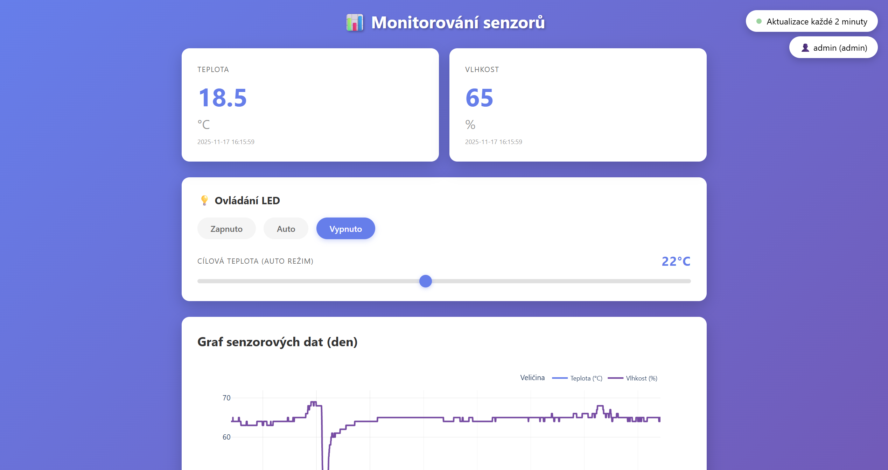
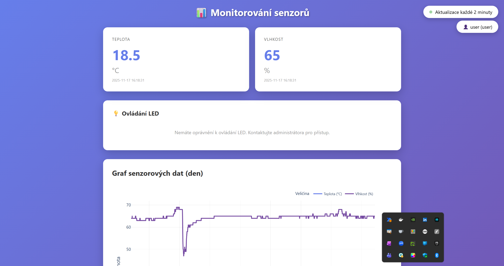
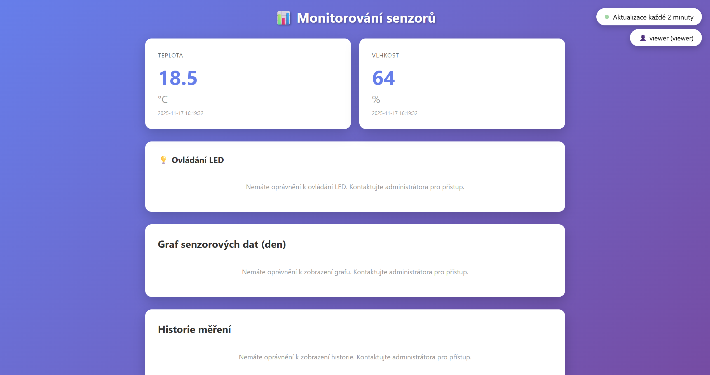

# Vizuální průvodce aplikací

## 🎨 UI Design

Aplikace používá moderní gradient design s fialovou barevnou paletou pro profesionální vzhled.

### Barevná schémata:
- **Gradient pozadí:** `linear-gradient(135deg, #667eea 0%, #764ba2 100%)`
- **Primární barva:** `#667eea` (světle fialová)
- **Sekundární barva:** `#764ba2` (tmavě fialová)
- **Text:** `#333` (tmavě šedá)
- **Disabled text:** `#999` (světle šedá)

---

## 📸 Screenshots

### 1. Dashboard - Admin View

**Přístup:** admin / admin123



**Co admin vidí:**
- ✅ Aktuální teplota a vlhkost
- ✅ Ovládání LED (On/Off/Auto)
- ✅ Graf za poslední 24 hodin
- ✅ Historie posledních 10 měření
- ✅ Uživatelské jméno a role v pravém horním rohu

---

### 2. Dashboard - User View

**Přístup:** user / user123



**Co user vidí:**
- ✅ Aktuální teplota a vlhkost
- ❌ Ovládání LED - zobrazí se zpráva: *"Nemáte oprávnění k ovládání LED"*
- ✅ Graf za poslední 24 hodin
- ✅ Historie posledních 10 měření

**Rozdíl oproti admin:**
- Nemůže ovládat LED (sekce je zobrazena, ale je disabled s informační zprávou)

---

### 3. Dashboard - Viewer View

**Přístup:** viewer / viewer123



**Co viewer vidí:**
- ✅ Aktuální teplota a vlhkost
- ❌ Ovládání LED - zobrazí se zpráva: *"Nemáte oprávnění k ovládání LED"*
- ❌ Graf - zobrazí se zpráva: *"Nemáte oprávnění k zobrazení grafu"*
- ❌ Historie - zobrazí se zpráva: *"Nemáte oprávnění k zobrazení historie"*

**Rozdíl oproti user:**
- Nemá přístup k historii ani grafu
- Vidí pouze aktuální měření

---

## 🎯 UI Komponenty

### Status Badge

V pravém horním rohu se zobrazuje:
- Zelená tečka s pulzující animací
- Text: "Aktualizace každé 2 minuty"

Pod tím:
- Ikona uživatele 👤
- Uživatelské jméno a role v závorce
- Příklad: `👤 admin (admin)`

---

### Karty s aktuálními hodnotami

Dvě bílé karty s:
- Název veličiny (TEPLOTA / VLHKOST)
- Velká hodnota (48px font)
- Jednotka (°C / %)
- Časové razítko

**Hover efekt:** Karta se zvýrazní (translateY -5px)

---

### LED Ovládání

**Pro uživatele s oprávněním:**

Tři radio buttony:
- **Zapnuto** - LED svítí trvale
- **Auto** - Termostatický režim
- **Vypnuto** - LED nesvítí

Range slider (10-36°C):
- Zobrazuje aktuální hodnotu v reálném čase
- Velký modře-fialový thumb pro snadné ovládání
- Step: 2°C

**Pro uživatele bez oprávnění:**
- Stejná sekce, ale místo ovládacích prvků je šedý text
- Informace: "Nemáte oprávnění k ovládání LED. Kontaktujte administrátora pro přístup."

---

### Graf

**Plotly interaktivní graf:**
- Dvě křivky:
  - 🟣 Teplota (°C) - fialová `#667eea`
  - 🟪 Vlhkost (%) - tmavě fialová `#764ba2`
- X osa: Čas (formát HH:MM:SS)
- Y osa: Hodnota
- Hover: Unified crosshair s hodnotami obou veličin
- Height: 640px

**Cache-busting:**
- Graf se reloaduje každé 2 minuty s query parametrem `?ts=<timestamp>`
- Zabraňuje cachování starých dat v prohlížeči

---

### Historie měření

Tabulka s 3 sloupci:
- **Čas** - Formát: YYYY-MM-DD HH:MM:SS
- **Teplota (°C)** - Zaokrouhleno na 1 desetinné místo
- **Vlhkost (%)** - Zaokrouhleno na 1 desetinné místo

**Styling:**
- Fialové header (#667eea)
- Bílý text v headeru
- Hover efekt na řádcích (světle šedé pozadí)
- Poslední řádek má border-bottom

---

## 🔐 Přihlašovací dialog

Když uživatel navštíví aplikaci poprvé nebo se odhlásí, prohlížeč zobrazí standardní HTTP Basic Auth dialog:

```
┌─────────────────────────────────────┐
│  Authentication Required            │
│                                     │
│  The server requires a username     │
│  and password.                      │
│                                     │
│  Username: [___________________]    │
│  Password: [___________________]    │
│                                     │
│  [ Cancel ]  [ Log In ]            │
└─────────────────────────────────────┘
```

**Testovací účty:**
- admin / admin123
- user / user123
- viewer / viewer123

---

## 📱 Responzivní design

Dashboard je responzivní a přizpůsobí se různým velikostem obrazovky:

### Desktop (>1000px)
- Karty vedle sebe v mřížce
- Graf na plnou šířku
- Tabulka s dostatečným prostorem

### Tablet (600-1000px)
- Karty stále vedle sebe
- Graf se přizpůsobí
- Scrollovatelná tabulka

### Mobil (<600px)
- Karty pod sebou
- Graf scrollable horizontálně
- Tabulka scrollable

**Grid layout:**
```css
.cards {
    display: grid;
    grid-template-columns: repeat(auto-fit, minmax(250px, 1fr));
    gap: 20px;
}
```

---

## 🎭 Animace a efekty

### Pulzující tečka
Status indicator používá keyframe animaci:

```css
@keyframes pulse {
    0%, 100% { opacity: 1; }
    50% { opacity: 0.5; }
}
```

**Efekt:** Zelená tečka pulzuje každé 2 sekundy

---

### Hover efekty

**Karty:**
```css
.card:hover {
    transform: translateY(-5px);
    transition: transform 0.3s ease;
}
```

**Radio buttony:**
```css
.radio-group label:hover span {
    transform: translateY(-2px);
    box-shadow: 0 5px 15px rgba(0,0,0,0.1);
}
```

**Range thumb:**
```css
input[type="range"]::-webkit-slider-thumb:hover {
    transform: scale(1.2);
    box-shadow: 0 4px 12px rgba(102, 126, 234, 0.6);
}
```

---

## 📊 Graf - Detailní nastavení

### Plotly konfigurace

```python
fig = px.line(
    df,
    x="timestamp",
    y=["temperature", "humidity"],
    title="",
    labels={"timestamp": "Čas", "value": "Hodnota", "variable": "Veličina"}
)

# Styling
fig.data[0].name = "Teplota (°C)"
fig.data[1].name = "Vlhkost (%)"
fig.data[0].line.color = "#667eea"
fig.data[1].line.color = "#764ba2"
fig.data[0].line.width = 3
fig.data[1].line.width = 3

# Layout
fig.update_layout(
    xaxis=dict(tickformat="%H:%M:%S"),
    yaxis=dict(title="Hodnota"),
    hovermode="x unified",
    template="plotly_white",
    height=550
)
```

### Interaktivita

- **Zoom:** Klik a tažení pro zoom na oblast
- **Pan:** Shift + tažení pro posun
- **Hover:** Zobrazení hodnot obou křivek současně
- **Legend:** Klik na legendu vypne/zapne křivku
- **Reset:** Dvojklik resetuje zoom

---

## 🎨 Typografie

### Font family
```css
font-family: 'Segoe UI', Tahoma, Geneva, Verdana, sans-serif;
```

### Velikosti písma

- **H1 (nadpis):** Default (inherits from browser)
- **H2 (sekce):** 20px
- **Card hodnota:** 48px (bold)
- **Card jednotka:** 24px
- **Card popisek:** 14px (uppercase, letter-spacing: 1px)
- **Běžný text:** 14-16px
- **Malý text (timestamp):** 12px

---

## 🔄 Real-time Updates

### JavaScript intervaly

```javascript
// Aktualizace dat každé 2 minuty
setInterval(updateData, 120000);

// Aktualizace grafu každé 2 minuty (pouze pro uživatele s oprávněním)

setInterval(updateGraph, 120000);

```

### Fetch API

```javascript
async function updateData() {
    const response = await fetch('/api/data');
    const data = await response.json();

    // Update DOM
    document.getElementById('temperature').textContent = data.temperature;
    document.getElementById('humidity').textContent = data.humidity;
    // ...
}
```

---

## 🎬 Průchod aplikací (User Flow)

### 1. Návštěva aplikace
```
http://localhost:5000
    ↓
Přihlašovací dialog
    ↓
Zadání credentials
    ↓
Dashboard (role-specific)
```

### 2. Zobrazení dat
```
Dashboard
    ↓
Automatické načtení dat z /api/data
    ↓
Zobrazení v kartách + tabulce
    ↓
Načtení grafu z /api/graph (iframe)
    ↓
Auto-refresh každé 2 minuty
```

### 3. Ovládání LED (pouze admin)
```
Výběr režimu (On/Off/Auto)
    ↓
POST /api/led s JSON payload
    ↓
Server kontrola oprávnění
    ↓
Změna stavu LED
    ↓
Logování akce
    ↓
Response do UI
```

---

## 💡 Tips & Tricks

### 1. Rychlé testování rolí
Použij více prohlížečů nebo anonymní okna:
- Chrome normální: admin
- Chrome anonymní: user
- Firefox: viewer

### 2. Sledování změn v real-time
Otevři terminál a sleduj logy:
```bash
tail -f logs/app.log
```

### 3. DevTools
Otevři F12 a sleduj:
- Network tab: API requesty
- Console: JavaScript chyby
- Application: Cookies a storage

### 4. Curl testování
```bash
# Rychlý test bez prohlížeče
curl -u admin:admin123 http://localhost:5000/api/data | jq '.'
```

---

## 📐 Layout měření

### Container
- Max width: 1000px
- Centrovaný: `margin: 0 auto`
- Padding: 20px

### Cards
- Border radius: 15px
- Padding: 30px
- Box shadow: `0 10px 30px rgba(0,0,0,0.2)`
- Gap mezi kartami: 20px

### Status badges
- Position: fixed
- Top: 20px / 70px
- Right: 20px
- Padding: 10px 20px
- Border radius: 25px

---

Tato dokumentace poskytuje kompletní přehled vizuálního designu a uživatelského rozhraní aplikace. Pro další technické detaily viz hlavní [README.md](../README.md).
