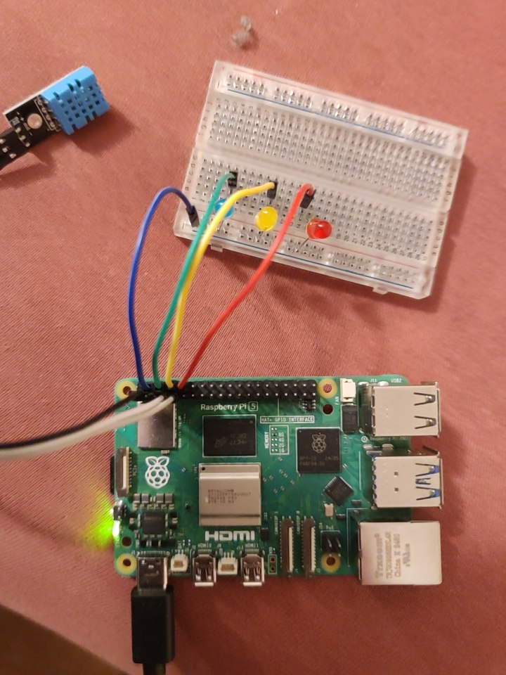

## Zapojení

**DHT11:**

pin 1 - 3,3 V
pin 7 - GPIO 4
pin 9 - ground

**LEDky:**

pin 6 - ground - na breadboard
pin 8 - GPIO14 - modrá
pin 10 - GPIO15 - žlutá
pin 12 - GPIO18 - červená

- odpor doporučen, ale v rámci testu bez. 

**Funkcionalita:** 

- Modrá LED svítí, pokud je aktivní režim "AUTO"
- Žlutá led svítí, pokud v režimu "AUTO" program "dohřívá"
- Červená LED svítí, pokud se "dohřívá" manuálmně

